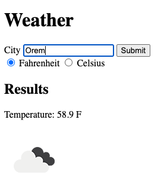

# weather-app

This is a weather app that consumes an API to display the weather for any location.

    

## Features

- Asynchronously pulls both the temperature and corresponding temperatures icon.
- Displays temperature in Fahrenheit or Celsius.

## Demo

- https://cameronstamant.github.io/weather-app/
